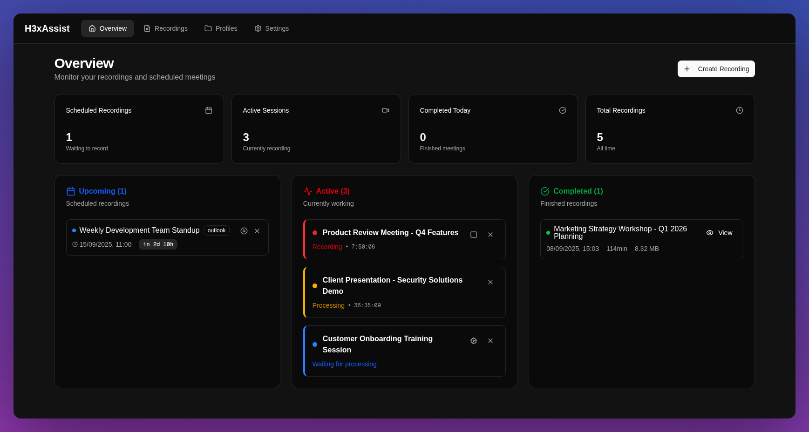
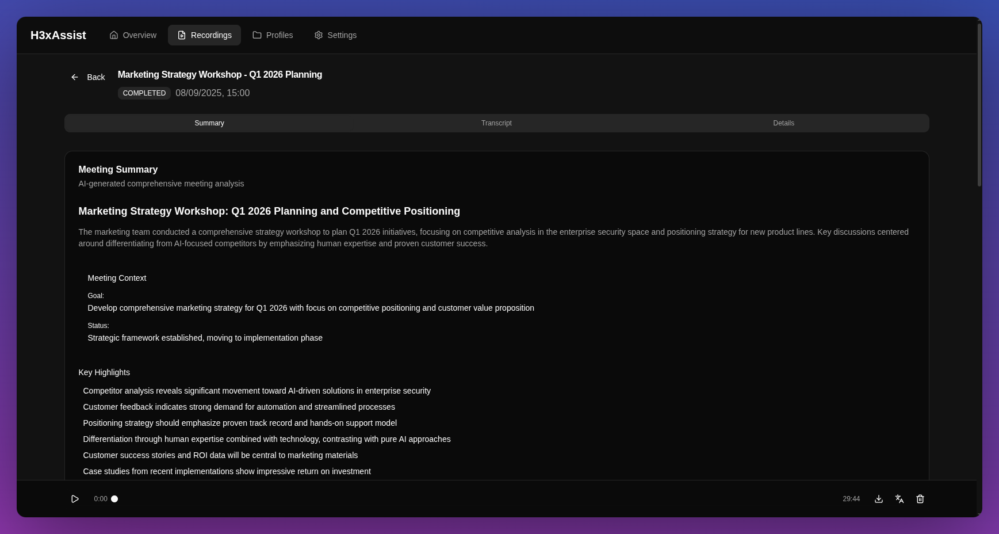
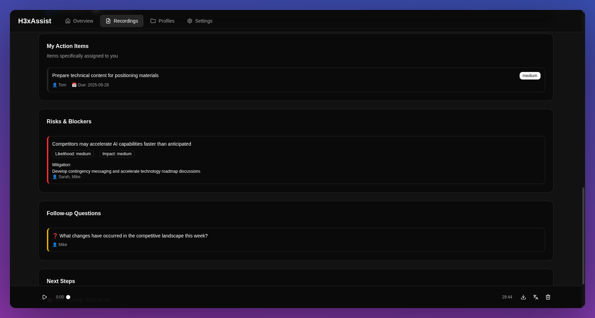
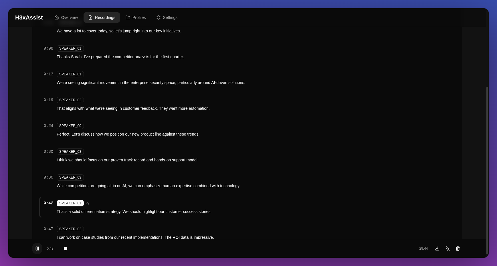
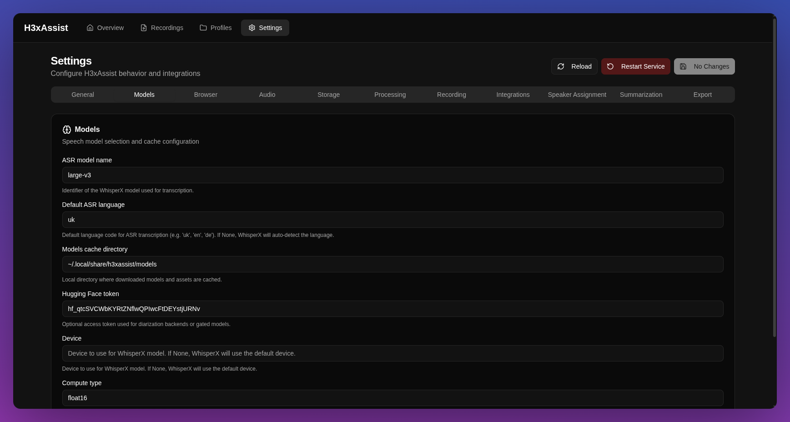
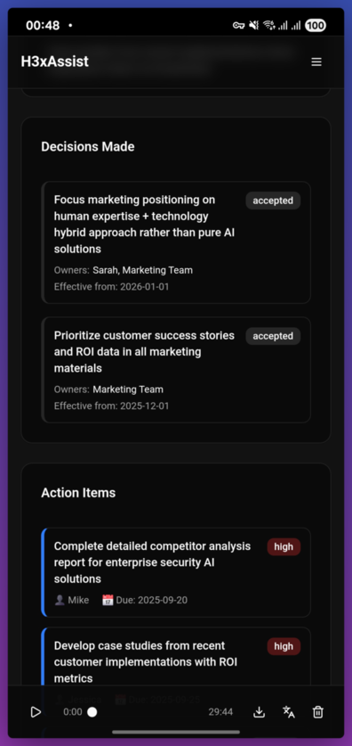

# H3xAssist

Automated meeting assistant that can join, record, transcribe, and summarize online meetings. Built with modern Python and Next.js.

## Screenshots

<div align="center">
  
  <br>
  <em>Real-time dashboard overview</em>
</div>

<div align="center">
  
  <br>
  <em>AI-generated meeting summary</em>
</div>

<div align="center">
  
  <br>
  <em>Action items and follow-up questions</em>
</div>

<div align="center">
  
  <br>
  <em>Transcription synchronized with audio</em>
</div>

<div align="center">
  
  <br>
  <em>Comprehensive settings configuration</em>
</div>

<div align="center">
  
  <br>
  <em>Responsive design optimized for mobile devices</em>
</div>

## Features

- **Automatic Meeting Join** - Supports Microsoft Teams and Google Meet with browser automation
- **Audio Recording** - High-quality audio capture with PipeWire integration
- **Speech Recognition** - WhisperX-powered transcription with speaker diarization
- **AI Summarization** - Google Gemini-generated meeting summaries
- **Calendar Integration** - Automatic Outlook calendar synchronization
- **Modern Web Interface** - Real-time dashboard built with Next.js and responsive design
- **Mobile Friendly** - Adaptive interface optimized for all screen sizes
- **Real-time Updates** - WebSocket-powered live status updates

## Architecture

- **Python Backend** - FastAPI server with async task management
- **Next.js Frontend** - Modern React dashboard with TypeScript and responsive design
- **Browser Automation** - Playwright for meeting platform integration
- **Audio Pipeline** - PipeWire + FFmpeg for Linux audio processing
- **AI Integration** - WhisperX for transcription, Google Gemini for summaries

## Quick Start

### Prerequisites

- Linux with PipeWire audio system
- Python 3.12+
- Node.js 18+ and pnpm
- Chromium/Chrome browser
- [Task](https://taskfile.dev) (recommended for easier setup)

### Installation with Task (Recommended)

1. **Clone the repository**
   
   ```bash
   git clone https://github.com/yourusername/h3xassist.git
   cd h3xassist
   ```

2. **Install all dependencies**
   
   ```bash
   task install
   ```

3. **Run setup wizard**
   
   ```bash
   task setup
   ```

4. **Download AI models**
   
   ```bash
   uv run h3xassist setup models
   ```

5. **Start the application**
   
   ```bash
   task prod
   ```

6. **Configure and use**
   
   Open http://localhost:11411 in your browser and complete the setup through the web interface

### Manual Installation

1. **Clone the repository**
   
   ```bash
   git clone https://github.com/yourusername/h3xassist.git
   cd h3xassist
   ```

2. **Install Python dependencies**
   
   ```bash
   uv sync
   ```

3. **Install frontend dependencies**
   
   ```bash
   cd h3xassist-web
   pnpm install
   cd ..
   ```

4. **Run configuration**
   
   ```bash
   uv run h3xassist config
   ```

5. **Download AI models**
   
   ```bash
   uv run h3xassist setup models
   ```

6. **Build and start the service**
   
   ```bash
   cd h3xassist-web && pnpm build && cd ..
   uv run h3xassist service run
   ```

7. **Configure and use**
   
   Open http://127.0.0.1:11411 in your browser and complete the setup through the web interface

### Optional Setup Commands

- **Browser profiles**: `uv run h3xassist setup browser`
- **Outlook integration**: `uv run h3xassist setup outlook`
- **AI models**: `uv run h3xassist setup models`

## Usage

### Manual Recording

1. Open the web interface at http://127.0.0.1:11411
2. Click "New Recording" 
3. Enter meeting details and URL
4. Click "Start Recording"
5. The system will join, record, and process automatically

### Automatic Scheduling

1. Configure Outlook integration via `uv run h3xassist setup outlook`
2. The system will automatically sync your calendar
3. Recordings are scheduled 2 minutes before meeting start
4. Processing happens automatically after the meeting ends

### Configuration

Configuration is managed through two methods:

**1. Interactive CLI Configuration**
```bash
uv run h3xassist config
```
Guided setup wizard for API keys, model settings, and integrations.

**2. Web Interface Settings**

Access settings through the web dashboard at http://127.0.0.1:11411/settings

**Configuration File Location**

Settings are stored in YAML format at `~/.config/h3xassist/settings.yaml`:

```yaml
general:
  meeting_display_name: "Meeting Bot"

http:
  host: "127.0.0.1"
  port: 11411

models:
  whisperx_model_name: "large-v3"
  hf_token: "your_huggingface_token"

summarization:
  provider_token: "your_google_api_key"

integrations:
  outlook:
    tenant_id: "your_tenant_id"
    client_id: "your_client_id"
```

**Note**: Host and port are configurable through settings. The default values are shown above.

## Development

### Using Task (Recommended)

```bash
# Development workflow
task dev            # Start both backend and frontend
task dev:backend    # Start backend only
task dev:frontend   # Start frontend only

# Code quality
task format         # Format all code
task lint           # Lint all code  
task typecheck      # Type checking
task check          # Run all checks
task fix            # Auto-fix linting issues

# Production
task build          # Build frontend
task prod           # Build and start production

# Utilities
task types          # Generate TypeScript types
task clean          # Clean build artifacts
task help           # Show help
```

### Manual Commands

```bash
# Start development server
uv run h3xassist service run

# Run linting
uv run ruff check src/
uv run mypy

# Format code
uv run ruff format src/

# Start frontend development
cd h3xassist-web && pnpm dev
```

### Testing

Currently, testing is done manually via the web interface. The project focuses on functionality over extensive test coverage for this pet project scope.

### Troubleshooting

#### CUDA/cuDNN Library Issues

If you encounter errors related to missing CUDA/cuDNN libraries (e.g., `libcudnn_ops_infer.so.8`), you can install the required libraries system-wide using the provided script:

```bash
# Install cuDNN 8.x libraries system-wide
./scripts/install_cudnn8_system.sh
```

This script will:
- Download the appropriate cuDNN wheel package
- Extract and install the libraries to `/var/opt/cudnn8/lib`
- Configure system library paths via ldconfig
- Verify the installation

**Note**: This script requires `sudo` privileges and is designed for Linux systems with CUDA support.

## Project Structure

```
h3xassist/
   src/h3xassist/          # Python backend
      api/                # FastAPI server and routes
      audio/              # Audio recording pipeline  
      browser/            # Playwright automation
      cli/                # Typer CLI interface
      models/             # Pydantic data models
      postprocess/        # Transcription and summarization
      scheduler/          # Meeting scheduling
   h3xassist-web/          # Next.js frontend
   pyproject.toml          # Python dependencies and config
```

## Privacy & Security

- **Local Processing** - All audio processing happens locally
- **No Cloud Storage** - Recordings stored only on your machine
- **Configurable Data** - Choose what gets summarized and exported
- **Open Source** - Full transparency in data handling

## License

AGPL v3 License - see [LICENSE](LICENSE) file for details.

## Contributing

This is a personal pet project. Feel free to fork and modify for your own use!

## Disclaimer

This tool is for legitimate meeting recording purposes only. Ensure you have proper permissions and comply with local laws regarding recording meetings and conversations.

---

Built with Python, FastAPI, Next.js, and modern AI tools.